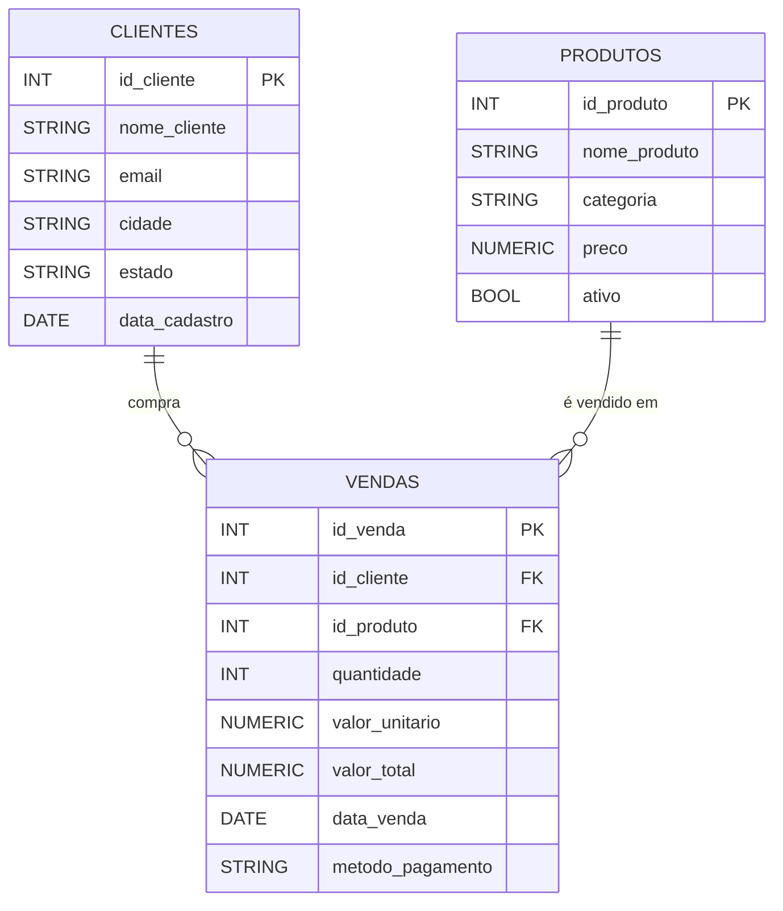

## Modelo de ERD (Mermaid)

```mermaid
erDiagram
  CLIENTES {
    INT id_cliente PK
    STRING nome_cliente
    STRING email
    STRING cidade
    STRING estado
    DATE data_cadastro
  }
  PRODUTOS {
    INT id_produto PK
    STRING nome_produto
    STRING categoria
    NUMERIC preco
    BOOL ativo
  }
  VENDAS {
    INT id_venda PK
    INT id_cliente FK
    INT id_produto FK
    INT quantidade
    NUMERIC valor_unitario
    NUMERIC valor_total
    DATE data_venda
    STRING metodo_pagamento
  }
  CLIENTES ||--o{ VENDAS : "compra"
  PRODUTOS ||--o{ VENDAS : "é vendido em"
```

---
## Licença
- MIT
