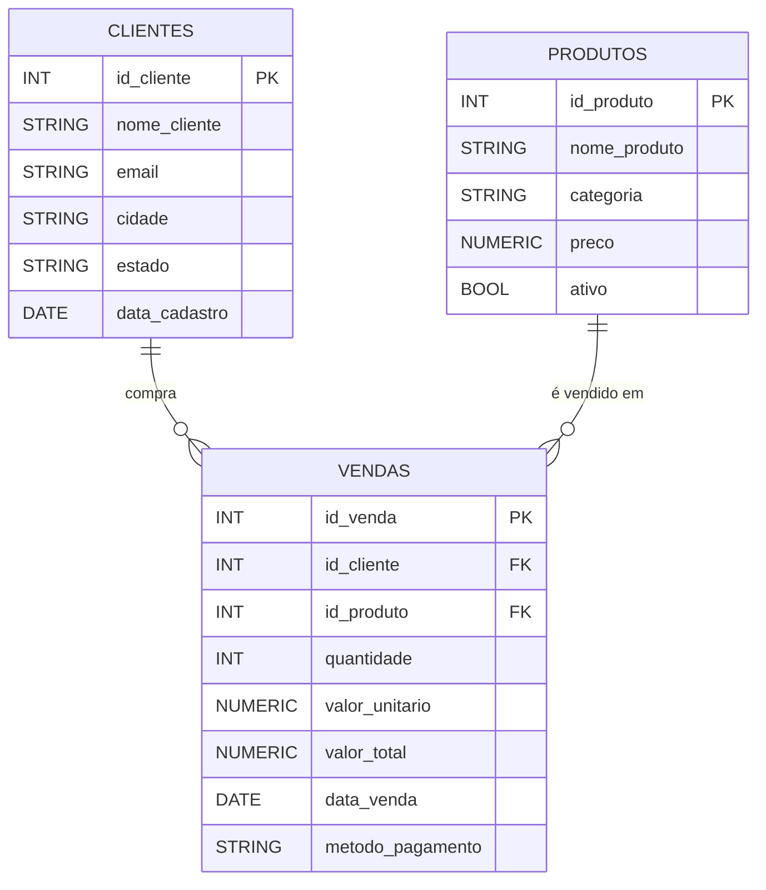

# DesenvolveGB-Projeto2 — Mini Projeto SQL (BigQuery)

Projeto simples de **SQL 100% online** usando o **BigQuery Web UI** (Sandbox gratuito).  
Ele cria três tabelas (`Clientes`, `Produtos`, `Vendas`) e responde perguntas de negócio com consultas SQL.

> **Como usar (resumo):**
> 1. Crie um *dataset* no BigQuery chamado **`desenvolvegb_projeto2`** (ou outro nome).
> 2. Cole e execute `sql/01_ddl.sql` (cria as tabelas).
> 3. Cole e execute `sql/02_dml_inserts.sql` (insere dados de exemplo).
> 4. Rode as consultas de `sql/03_consultas.sql`.
> 5. Faça *commit* destes arquivos neste repositório.

---

## Passo a passo (bem direto)

### 0) Preparar o repositório (GitHub)
- Crie no GitHub um repositório público chamado **DesenvolveGB-Projeto2**.
- Adicione os arquivos deste projeto: `README.md` e a pasta `sql/` (você pode fazer *Upload files* direto pelo site).

### 1) Abrir o BigQuery (100% online)
- Acesse o **BigQuery Console** pelo navegador (pode usar o Sandbox; não precisa instalar nada).
- No painel esquerdo, clique no ícone do seu projeto do Google Cloud.
- Clique em **⋮ > Create dataset** e crie um dataset com ID **`desenvolvegb_projeto2`** (pode usar outro nome se quiser).

> **Importante:** Se mudar o nome do dataset, substitua **`desenvolvegb_projeto2`** por **`SEU_DATASET`** em todos os scripts.

### 2) Criar as tabelas (DDL)
- Abra um editor SQL no BigQuery e cole o conteúdo de **`sql/01_ddl.sql`**.
- Execute. Serão criadas as tabelas `Clientes`, `Produtos` e `Vendas`.

### 3) Inserir dados (DML)
- Em outro editor SQL, cole **`sql/02_dml_inserts.sql`**.
- Execute para popular as tabelas com dados de exemplo.

### 4) Executar as análises
- Cole e rode **`sql/03_consultas.sql`** para responder às perguntas.
- Você pode salvar o resultado de qualquer *query* como tabela ou CSV, tudo direto na web.

### 5) O que escrever no README do GitHub (modelo pronto)
- Descrição do projeto (use este arquivo).
- Esquema/ERD (abaixo tem um diagrama Mermaid que renderiza no GitHub).
- Como rodar (passos 1–4 acima).
- Lista de perguntas respondidas e *prints* dos resultados (opcional).

---

## Modelo de ERD (Mermaid)

---

## Arquivos deste repositório

- `sql/01_ddl.sql` — cria o schema/tabelas.
- `sql/02_dml_inserts.sql` — insere dados fictícios.
- `sql/03_consultas.sql` — consultas respondendo às perguntas.

---

## Créditos e licença
- Autor(a): você 😉
- Licença: MIT (use à vontade para estudar).
